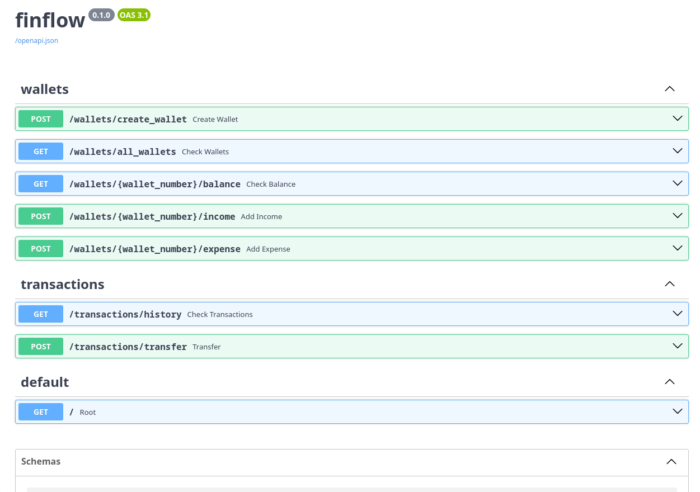

# 💳 FinFlow - Banking Wallet Microservice


## 📌 About

<p align="center">
  
</p>

FinFlow is a RESTful banking microservice built with **FastAPI** and **PostgreSQL**.  
It simulates core wallet operations: creating wallets, processing  
income/expense transactions, and checking balances.  
The data is validated using **pydantic**.
Card numbers are generated using the **Luhn algorithm**.  
The service is fully containerized with **Docker Compose**.

Built as a portfolio project to demonstrate backend development skills.

## ✨ Features

- **Wallet Management** — create wallets with unique 16-digit card numbers
- **Balance Check** — get current balance by card number  
- **Income Transactions** — deposit funds with description
- **Expense Transactions** — withdraw funds with insufficient balance protection
- **Luhn Algorithm** — card number generation & validation
- **Concurrency Safety** — SELECT FOR UPDATE prevents race conditions
- **Transaction History** — all operations stored in PostgreSQL
- **Docker Ready** — deploy with single command

## 🛠️ Tech Stack

| Layer          | Technology                        |
|----------------|-----------------------------------|
| Language       | Python 3.12                       |
| Framework      | FastAPI 0.115                     |
| Database       | PostgreSQL 16                     |
| ORM            | SQLAlchemy 2.0 (sync)             |
| Validation     | Pydantic v2                       |
| Containerization | Docker, Docker Compose          |
| DB Driver      | psycopg3                          |
| Algorithm      | Luhn (card number generation)     |

## 📁 Project Structure

```text
finflow/
├── app/
│   ├── database/
│   │   ├── __init__.py
│   │   └── connection.py
│   ├── routers/
│   │   ├── wallets.py
│   │   └── transactions.py
│   ├── utils/
│   │   ├── __init__.py
│   │   └── luhn.py
│   └── __init__.py
├── docs/
│   └── swagger-demo.png
├── tests/
├── .env.example
├── .gitignore
├── docker-compose.yml
├── Dockerfile
├── main.py
├── requirements.txt
└── README.md
```

## 🚀 Getting Started

### Prerequisites
- [Docker](https://docs.docker.com/get-docker/) & Docker Compose installed
- Docker Desktop running (Windows/macOS)

### Run

```bash
# Clone the repository
git clone https://github.com/Kol1brii/finflow.git
cd finflow

# Copy environment variables
cp .env.example .env  # Linux/macOS
# or
copy .env.example .env  # Windows

# Run with Docker
docker compose up --build
```

- The API will be available at: http://localhost:8000
- Interactive Swagger docs: http://localhost:8000/docs
- ReDoc: http://localhost:8000/redoc

## 🔮 Planned Improvements
- [X] To complete the database with the transaction history
- [ ] Complete the transaction system
- [ ] Add unit and integration tests (pytest)
- [ ] Switch to async SQLAlchemy (asyncpg)

## API Endpoints

### Wallets
| Method | Endpoint                              | Description           | Status |
|--------|---------------------------------------|-----------------------|--------|
| `POST` | `/wallets/create_wallet`              | Create a new wallet   | 201    |
| `GET`  | `/wallets/all_wallets`                | Get all wallets       | 200    |
| `GET`  | `/wallets/{wallet_number}/balance`    | Get wallet balance    | 200    |
| `POST` | `/wallets/{wallet_number}/income`     | Add income            | 200    |
| `POST` | `/wallets/{wallet_number}/expense`    | Add expense           | 200    |

### Request & Response Examples

<details>
<summary>POST /wallets/create_wallet</summary>

**Request:**

```json
{
  "name": "My Wallet",
  "balance": 1000.00
}
```

**Response `201`:**

```json
{
  "status": "wallet 'My Wallet' created",
  "wallet_id": "550e8400-e29b-41d4-a716-446655440000",
  "wallet_number": "4532015112830366",
  "name": "My Wallet",
  "balance": 1000.00
}
```
</details>

<details>
<summary>POST /wallets/{wallet_number}/income</summary>

**Request:**

```json
{
  "amount": 500.00,
  "description": "Salary",
  "date": "2025-01-01T12:00:00"
}
```

**Response `200`:**

```json
{
  "status": "Credited 500.00",
  "wallet_id": "550e8400-e29b-41d4-a716-446655440000",
  "amount": 500.00,
  "description": "Salary",
  "Total amount": 1500.00,
  "date": "2025-01-01T12:00:00"
}
```
</details>

<details>
<summary>POST /wallets/{wallet_number}/expense</summary>

**Request:**

```json
{
  "amount": 200.00,
  "description": "Groceries",
  "date": "2025-01-01T15:00:00"
}
```

**Response `200`:**

```json
{
  "status": "Debited 200.00",
  "wallet_id": "550e8400-e29b-41d4-a716-446655440000",
  "amount": 200.00,
  "description": "Groceries",
  "Total amount": 1300.00,
  "date": "2025-01-01T15:00:00"
}
```

**Response `400`** (insufficient funds):

```json
{
  "detail": "Insufficient funds"
}
```

**Response `404`** (wallet not found):

```json
{
  "detail": "Wallet '1234567890123456' not found"
}
```
</details>

<details>
<summary>GET /wallets/{wallet_number}/balance</summary>

**Response `200`:**

```json
{
  "wallet_id": "550e8400-e29b-41d4-a716-446655440000",
  "wallet_number": "4532015112830366",
  "name": "My Wallet",
  "balance": 1300.00
}
```

**Response `404`** (wallet not found):

```json
{
  "detail": "Wallet '1234567890123456' not found"
}
```
</details>

<details>
<summary>GET /wallets/all_wallets</summary>

**Response `200`:**

```json
[
  {
    "wallet_id": "550e8400-e29b-41d4-a716-446655440000",
    "wallet_number": "4532015112830366",
    "name": "My Wallet",
    "balance": 1300.00
  },
  {
    "wallet_id": "661f9511-f30c-52e5-b827-557766551111",
    "wallet_number": "4532015112830367",
    "name": "Second Wallet",
    "balance": 500.00
  }
]
```
</details>

## Database Schema

### `all_wallets`
| Column          | Type           | Description                    |
|-----------------|----------------|--------------------------------|
| `id`            | UUID (PK)      | Unique wallet identifier       |
| `wallet_number` | VARCHAR(16)    | Luhn-valid card number (unique)|
| `name`          | VARCHAR(32)    | Wallet name                    |
| `balance`       | NUMERIC(12, 2) | Current balance                |

### `transactions_history`
| Column      | Type           | Description                        |
|-------------|----------------|------------------------------------|
| `id`        | UUID (PK)      | Unique transaction identifier      |
| `wallet_id` | UUID (FK)      | Reference to `all_wallets.id`      |
| `status`    | VARCHAR(50)    | Transaction type (income/expense)  |
| `amount`    | NUMERIC(12, 2) | Transaction amount                 |
| `description` | VARCHAR(100) | Optional description               |
| `balance`   | NUMERIC(12, 2) | Balance after transaction          |
| `date`      | TIMESTAMPTZ    | Transaction timestamp (auto)       |

## 📄 License

This project is licensed under the MIT License — see the [LICENSE](LICENSE) file for details.